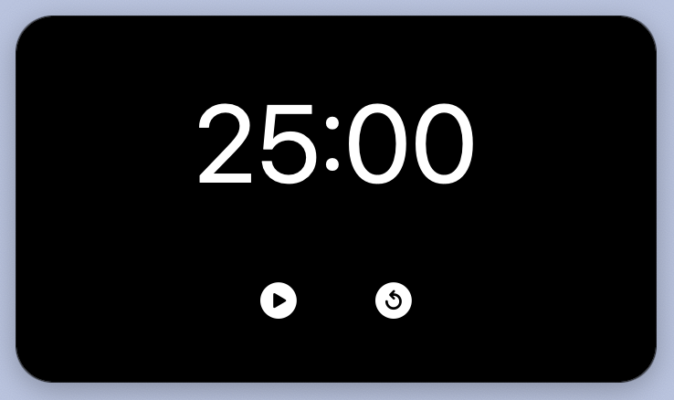
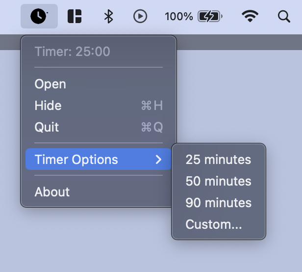

Zen

# Overview

Zen is a minimalist, simple and essential timer. Yet another Pomodoro app for macOS, developed using Swift. It was born from a personal project, where I wanted a personal timer, without too many features and customizations. 

In fact, the UI is very simple and is mostly controllable from the macOS menu.

# What is a Pomodoro timer

The Pomodoro® Technique is a time management method developed by Francesco Cirillo in the late 1980s. It is a structured method made up of processes, tools, principles and values to learn how to deal with time and turn it from a vicious predator to an ally to boost productivity. Read more [here](https://francescocirillo.com/products/the-pomodoro-technique).

# Features

Zen has a standard timer set at 25 minutes, which is customizable from the topbar.

When the timer runs out, a 5-minute break starts automatically. At the end of the break, another Pomodoro cycle starts again independently.

Zen will send notifications both when the timer ends and when it starts again. It was developed to be able to be hidden and to track the remaining timer in the background (which can still be accessed from the topbar). 

# How to install

You can either compile Zen from source manually or download the latest stable artifact [here](https://github.com/simoneb1x/zen).

# How to contribute

Feel free to contribute, or propose new features. I will look promptly at any request and will be happy to modify the app according to new preferences.